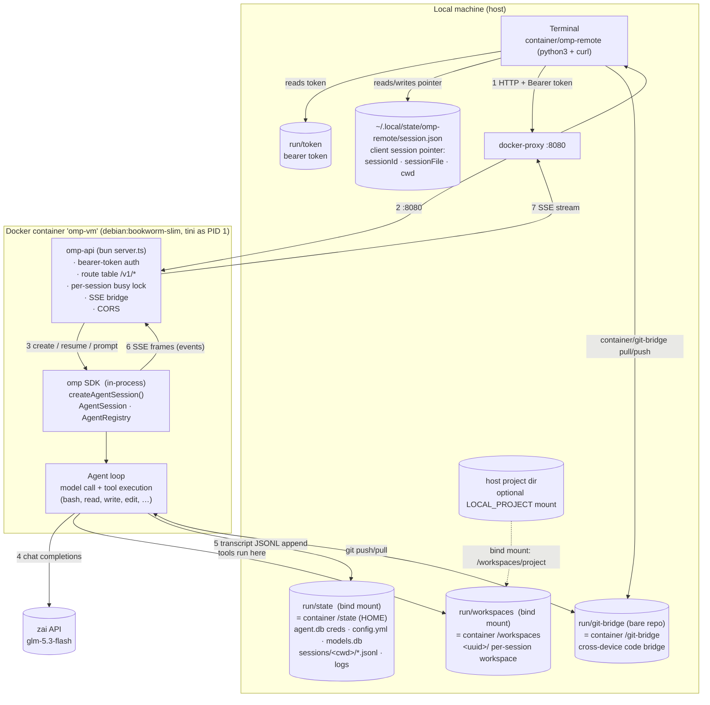
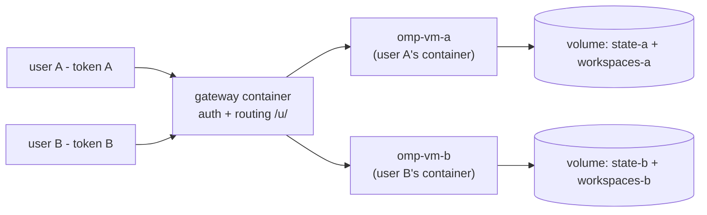

> **Kit note:** paths in this document use the development layout (`sim/…`); in this kit the same files live under `kit/container/…` and runtime state under `kit/container/run/…`. Behavior is identical.
# omp-on-Docker — Local Simulation Architecture

*Companion to `../gcp-deployment-report.md` (the GCP deployment plan this simulation mirrors). Everything below describes the system actually built and verified on this machine on 2026-09-06.*

---

## 1. What was built

A single-container deployment of the **oh-my-pi (omp)** coding agent behind a thin **HTTP API**, accessed from this machine by a small **terminal client** that maintains a persistent, multi-turn session. It is a faithful local stand-in for the report's Compute-Engine-VM architecture: the Docker container plays the VM, the published port plays the load balancer, and a bearer token plays IAP/OIDC.

```
terminal (omp-remote)  --HTTP/SSE-->  omp-api wrapper (in container)  --SDK-->  AgentSession (omp runtime)  --HTTPS-->  LLM provider (zai)
                                           |                                              |
                                     auth + routing                            tools run in /workspaces/<id>
                                                                                   transcript JSONL -> /state (state volume)
```

**Verified behaviors** (all observed during this session):

| Behavior | Evidence |
|---|---|
| Chat over HTTP with streaming | `PONG` round-trip, 2.5 s, clean SSE event sequence |
| Multi-turn session across separate client processes | taught codeword → `OK`; new invocation asked → `BANANA42` |
| Tool execution server-side | `hello.txt` / `cap.txt` created inside container via prompt; confirmed with `docker exec` |
| Session survives full container restart | `--down` + redeploy (new process, new token) → client auto-resumed from persisted transcript → codeword still recalled |
| Auth enforced | requests without `Authorization: Bearer <token>` → 401 |
| CORS preflight | `OPTIONS` → 204 + `Access-Control-Allow-*` headers |
| Smoke gate with provider-flake retry | `simulate.sh` retries once on first-attempt model failure |
| Host-file editing via bind mount | `LOCAL_PROJECT=<dir> bash sim/simulate.sh` → agent appended `EDITED-BY-OMP` to a real host file (verified on host, no copy step) |
| Git bridge, both directions | container edit → `--sync` → host `pull` (`GIT-FROM-AGENT`); host edit → `push` → `--sync` → agent read `HOST-NOTE-42` |

---

## 2. High-level architecture (end to end)




**How to read the workflow.** The diagram has one downstream (request) path and one upstream (event) path, plus three places where durable state actually lives. Downstream: everything starts at the terminal — `omp-remote` first gathers its two pieces of local state (the bearer token from `run/token` and the session pointer from `~/.local/state/omp-remote/session.json`), then sends the request as plain HTTP over the published port (edges **1–2**: host port → Docker's userland proxy → the wrapper inside the container). The wrapper is the only gatekeeper: it validates the token, resolves the route, and enforces the per-session busy lock. Edge **3** is the session-control step — the wrapper either reuses a live in-process session, resumes a persisted one from disk (`SessionManager.open`, used automatically after a container restart), or creates a fresh one bound to its own workspace directory. Only after that does the prompt reach the omp SDK.

The turn itself (middle of the diagram) runs three flows in parallel inside the container. The agent loop calls the LLM over the network (edge **4**) using credentials from the `agent.db` vault — no provider keys live in the environment; executes the model's tool calls (bash, read, write, edit, …) against the session's workspace directory on the workspaces volume; and appends every message, tool call, and result to the transcript JSONL on the state volume (edge **5**) continuously, not at the end of the turn — which is exactly why a crash or restart never loses more than the in-flight turn.

Upstream, the SDK emits fine-grained events (thinking deltas, tool-call lifecycles, text deltas) that the wrapper bridges one-to-one into SSE frames (edge **6**) and streams back over the same HTTP connection (edge **7**), where `omp-remote` renders them live and writes the session pointer it may need for a future resume. Note what the wrapper itself is *not*: it holds no durable state — just the live session map and busy flags. Everything durable sits in the two volumes plus the client pointer file. That separation (disposable compute, persistent state) is the property the whole design leans on: it is what makes restart-resume, `--clean` self-healing, and every scaling direction in §10 incremental changes rather than rewrites.

In git-bridge mode (`--git`), one further, optional data path exists: file changes travel as git commits between the container's clone and a host directory through the bare `git-bridge` repo — text only, no shared filesystem involved (§11).

Read the numbers as the request lifetime explained in §4.

### Sequence of one prompt

```mermaid
sequenceDiagram
  autonumber
  participant T as Terminal (omp-remote)
  participant A as omp-api (wrapper)
  participant S as AgentSession (SDK)
  participant M as zai glm-5.3-flash

  T->>T: load token (run/token), session pointer (~/.local/state/…)
  T->>A: GET /v1/sessions/:id
  alt wrapper knows the session (no restart)
    A-->>T: 200
  else wrapper restarted (map empty)
    A-->>T: 404
    T->>A: POST /v1/sessions {resume: sessionFile, cwd}
    A->>S: SessionManager.open(sessionFile)  — replay persisted JSONL
    A-->>T: 201 {sessionId, sessionFile, cwd}
  end
  T->>A: POST /v1/sessions/:id/prompt {text}   (curl -N, SSE)
  A->>S: subscribe(events) ; busy=true
  S->>M: chat completions (stream, creds from agent.db vault)
  loop until turn settles
    M-->>S: thinking / tool-call / text deltas
    S->>S: execute tools in /workspaces/<uuid> (yolo approval)
    S-->>A: AgentSessionEvent stream
    A-->>T: data: {…event…}   (SSE)
  end
  S-->>A: settled (result or error)
  A-->>T: event: done (or event: error) ; stream closes ; busy=false
  S->>SV: transcript entries appended (JSONL, persisted)
```

---

## 3. Component inventory

| Path / object | Layer | Role |
|---|---|---|
| `sim/simulate.sh` | automation | One-command lifecycle: import host creds → `docker build` → `docker run` → health wait → smoke test (+1 retry). `--down` removes the container; `--clean` also wipes image, state, and workspaces (root-owned files are removed from inside a container because the bind mounts contain root-owned files). |
| `sim/Dockerfile` | image | `debian:bookworm-slim` + `curl git jq tini sqlite3 ripgrep unzip` + Bun (installer needs `unzip`) + `bun install` of `@oh-my-pi/pi-coding-agent@18.1.11` (public npm). `ENTRYPOINT tini --` → `bun server.ts`. Declares `VOLUME /state, /workspaces`, `EXPOSE 8080`. At runtime the container runs as the host UID with `HOME=/state`. |
| `sim/server.ts` | API wrapper (Bun/TS) | Bearer-token auth (timing-safe compare), routing, session map, per-session busy lock (409), SSE bridge from `AgentSession` events with disconnect-safe enqueue/close, session create/resume, CORS, prompt size cap (413), **idle session eviction** (`OMP_SESSION_IDLE_MINUTES`, default 30 — safe because sessions are durable + resumable), structured request logging (`{"event":"http",method,path,status,ms}`) + `unhandledRejection`/`uncaughtException` logging, SIGTERM disposal. `GET /healthz` reports live + busy session counts. |
| `sim/package.json` | image build | Pins the npm dependency used inside the container. |
| `container/omp-remote` | client (python3 + curl, no other deps) | Maintains the session pointer, auto-resumes after wrapper restarts, and streams the **full agent view by default**: model thinking, tool calls with live output, todo lists, retries, compaction, notices, final answer (`--quiet` = text only, `--raw` = raw SSE). Session commands: `--new/--steer/--abort/--status/--sync`; modes: `--git`, `--cwd`. |
| `run/token` | secret | Bearer token (re-generated by each `simulate.sh` run; the client re-reads it every invocation). |
| `run/state/` → `/state` (via `HOME`) | persistent state | omp's entire config root: `agent/agent.db` (credential vault, SQLite), `agent/config.yml` (model roles: `zai/glm-5.3-flash`), `agent/models.db` (catalog cache), `agent/sessions/<encoded-cwd>/*.jsonl` (transcripts), `logs/`. |
| `run/workspaces/` → `/workspaces` | workspaces | One directory per session (`/workspaces/<uuid>`); where the agent's tools operate. Optional: `LOCAL_PROJECT=<dir>` bind-mounts a real host directory at `/workspaces/project` so agent edits hit live host files. |
| `run/git-bridge/` → `/git-bridge` | git bridge | Bare repo shared with the container; `--git` sessions clone it at `/workspaces/git/project` (§11). |
| `~/.local/state/omp-remote/session.json` | client state | `{sessionId, sessionFile, cwd, git}` — survives `--clean` on purpose; stale entries self-heal (404 → resume → fallback fresh); a `--git` mode switch starts a fresh session. |
| `container/git-bridge` | host helper | `seed/push/pull/log/reset` against the bare bridge repo — the local analog of your GitHub remote. `reset` closes the bridge: clears its history and the container's clone (start a new one with a fresh `seed`) |
| `sim/ui/` (server.mjs + public/) | web UI | browser console on `:8090`: login-gated workspace seeding (git URL or host dir), session start/steer/abort, and a live full-fidelity agent stream. Host-side backend holds the container token; browser never sees it (§12) |

**Container image facts:** port `8080`; env `OMP_API_TOKEN`, `WORKSPACES_DIR=/workspaces`, `PORT=8080`; omp config root at `/root/.omp` (the default — deliberately *not* relocated: `PI_CONFIG_DIR` is a directory **name relative to `$HOME`**, not an absolute path, per `packages/utils/src/dirs.ts:280-283`).

---

## 4. Step-by-step: local terminal → omp in Docker

What happens, in order, when you run:

```bash
container/omp-remote "Fix the failing test in src/auth.ts"
```

**Step 0 — Client bootstraps.**
python3 script starts. Reads the token from `run/token` (or `OMP_REMOTE_TOKEN`), base URL from `OMP_REMOTE_URL` (default `http://localhost:8080`), session pointer from `~/.local/state/omp-remote/session.json`.

**Step 1 — Session resolution (the "maintain a session" logic).**
- Pointer exists → `GET /v1/sessions/<id>` with `Authorization: Bearer`.
  - `200` → reuse the live in-memory session.
  - `404` → wrapper process was restarted (its session map is empty) but the transcript survived on the state volume → go to step 2b.
- No pointer → step 2a.

**Step 2 — Session creation.**
- **2a Fresh:** `POST /v1/sessions` `{}`. Wrapper picks `cwd = /workspaces/<uuid>`, creates it, builds `createAgentSession({ cwd, sessionManager: SessionManager.create(cwd), registry: new AgentRegistry(), autoApprove: true, telemetry: undefined })`. Answers `201 {sessionId, cwd, sessionFile, modelFallbackMessage}`.
- **2b Resume:** `POST /v1/sessions {resume: <sessionFile>, cwd: <cwd>}`. Wrapper uses `SessionManager.open(sessionFile)` — omp replays the persisted JSONL so the full conversation history returns. On resume failure (e.g. state wiped by `--clean`) the client transparently falls back to 2a.
- **2c Git-bridge mode:** `POST /v1/sessions {gitBridge: true}`. Wrapper pins `cwd = /workspaces/git/project` and ensures it is a clone of the bare bridge repo (`ensureGitWorkspace()`), then proceeds as a normal session. Files move between this clone and your machine only as commits (`--sync` and `container/git-bridge`, §11).

**Step 3 — Prompt submission.**
`POST /v1/sessions/<id>/prompt` with `{"text": …}` via `curl -N` (no buffering, SSE). Wrapper checks the per-session `busy` flag: already running → `409 {"error":{"code":"session_busy"}}`; else sets `busy = true`, subscribes to the session's event stream, and calls `session.prompt(text)`.

**Step 4 — Agent turn inside the container.**
The SDK's agent loop: assembles context (system prompt, tools, transcript), calls the configured model (`modelRoles.default: zai/glm-5.3-flash`) using credentials from the `agent.db` vault (no provider env keys needed — they were imported from the host's `~/.omp`), and executes tool calls (`read`, `write`, `edit`, `bash`, …) with **yolo approval** inside the container sandbox — i.e. against `/workspaces/<uuid>`. Provider/model quirks come from omp's bundled catalog.

**Step 5 — Event streaming back.**
Every `AgentSessionEvent` is forwarded verbatim as an SSE `data:` frame. Event catalogue (observed in captures):

| Event | Meaning |
|---|---|
| `agent_start`, `agent_end` | agent run boundaries |
| `turn_start`, `turn_end` | turn boundaries |
| `message_start` / `message_end` | a message (user or assistant, `.message.role`) entered/left |
| `message_update` + `assistantMessageEvent.type = thinking_start/delta/end` | model reasoning stream |
| `message_update` + `… toolcall_start/delta/end` | model emitting a tool call (`toolCall.name`, `arguments`) |
| `message_update` + `… text_start/delta/end` | visible assistant text |
| `tool_execution_start/update/end` | server-side tool execution lifecycle |
| `event: done` + `data` | turn settled successfully (stream closes) |
| `event: error` + `data` | turn failed (stream closes, client exits non-zero) |

**Step 6 — Persistence.**
omp appends every transcript entry to `/state/agent/sessions/--workspaces-<uuid>--/<timestamp>_<sessionId>.jsonl` — on the bind mount, i.e. `run/state/...` on the host. This file is what makes resume possible.

**Step 7 — Client rendering.**
`text_delta` → live stdout; `toolcall_end` → one dim line `⚙ <tool>: <intent/args>`; `thinking` → hidden unless `OMP_REMOTE_THINK=1`; `done` → exit 0; `error` → message to stderr, exit 1.

**Failure modes and how they surface**

| Condition | HTTP | Client behavior |
|---|---|---|
| Missing/bad token | 401 | `unauthorized` reported, exit 1 |
| Unknown session id | 404 | auto-resume (step 2b) |
| Turn already running | 409 | reports `session_busy`; use `--abort` |
| Malformed prompt | 400 | `text required` |
| Provider/model failure mid-turn | SSE `event: error` | stderr message, exit 1 |

---

## 5. Session lifecycle & what survives what

| Event | In-memory session map (wrapper) | Transcripts + workspace (volumes) | Client pointer (`~/.local/state/…`) | Consequence |
|---|---|---|---|---|
| Normal use | live | grows | stable | instant reuse |
| `--down` + redeploy | destroyed | **kept** | kept | next prompt auto-resumes (step 2b) |
| Token rotation (each `simulate.sh` run) | n/a | n/a | n/a | client re-reads `run/token` every call |
| `--clean` | destroyed | **destroyed** | kept | pointer stale → resume fails → fresh session (self-heal) |
| `--new` | untouched (server-side session orphaned until container restart) | kept | **deleted** | guaranteed fresh context next prompt |

Delete a session server-side with `DELETE /v1/sessions/:id` (disposes the SDK session; files remain until `--clean`).

---

## 6. Networking & security

- **Path:** terminal process → `localhost:8080` → Docker userland proxy → container `eth0:8080` → `bun server.ts` → in-process SDK. No TLS locally (TLS terminates at the LB in the cloud design).
- **Auth:** every `/v1/*` route requires `Authorization: Bearer <token>`; `/healthz` is open (probe-style). Token is 24 random hex bytes, stored in `run/token`.
- **CORS:** `OPTIONS` preflight → 204 with `Access-Control-Allow-Origin: *` (+ methods/headers), and the same headers on every response — enough for a browser app on `localhost` during development. For production, replace `*` with your app origin and keep the token server-side (browser JS can't safely hold it).
- **Approval model:** sessions run with `autoApprove: true` (yolo — all tool tiers auto-approved) *inside the container sandbox*; set `OMP_APPROVAL=restricted` in `simulate.sh`'s container env to switch to `tools.approvalMode: write`. The isolation boundary is the container, not the approval layer.
- **Host-project mount (`LOCAL_PROJECT`):** deliberately collapses the container boundary for that one directory — the agent's yolo-approved tools and shell reach real host files. Mount the narrowest directory needed (never `$HOME`); mounted git repos work thanks to the image's `git config --system --add safe.directory '*'`.
- **Known caveats (inherited, deliberate):** workspaces may contain a `.env` that omp loads at boot; the container's `agent.db` holds real provider credentials imported from the host — treat `run/state/` as secret. The container runs as your host UID with `HOME=/state`, so agent-created files are user-owned and directly removable from the host; legacy root-owned files (from deployments before 2026-09-07) are cleared by the UI's remove fallback (`docker exec … rm -rf`) or a one-time `chown` during `simulate.sh`.

---

## 7. Operations cheat-sheet

```bash
bash sim/simulate.sh            # deploy (idempotent) + smoke test
bash sim/simulate.sh --down     # stop & remove container (state kept)
bash sim/simulate.sh --clean    # remove container + image + state/workspaces/token
docker logs -f omp-vm           # wrapper stdout (listening line, crashes)
docker exec -it omp-vm bash     # inspect inside (state: /state, workspaces: /workspaces)
container/omp-remote --status         # client session pointer + live API state
```

- **Smoke test:** creates a session, prompts `Reply with exactly: PONG`, greps for `PONG` in the concatenated SSE; retries once with a fresh session before reporting `SMOKE DEGRADED` (guards against thinking-model flakes — one was observed live: a 5-minute reasoning runaway on a trivial prompt).
- **Health wait:** up to 60 × 1 s probes of `/healthz` after container start.
- **Credential import (each deploy):** `sqlite3 ~/.omp/agent/agent.db ".backup …"` (consistent snapshot, WAL included) + copies of `config.yml` / `models.yml` / `models.db` into `run/state/.omp/agent/`. Skip with `IMPORT_HOST_OMP_CONFIG=0`.

**Troubleshooting map**

| Symptom | Cause → fix |
|---|---|
| `permission denied … docker.sock` | user not in `docker` group → `sudo usermod -aG docker $USER` (script self-re-execs via `sg` when possible) |
| `No model selected` at prompt | credential import not visible to the container (mount must map `run/state/.omp` → `$HOME/.omp`, now `/state`) — fixed in current `simulate.sh` |
| `curl: (18)` + giant junk transcript | provider/model flake → retry (script does this); see `run/smoke.sse` |
| 409 on every prompt | earlier turn still running → `container/omp-remote --abort` |
| `--sync` returns `sync_failed` (500) | push/rebase conflict — the same file changed on host and in the container; resolve inside the session (ask the agent) or on the host, then re-sync |
| Client says fresh session unexpectedly | `--clean` wiped server state; pointer self-heals, history is gone by design |

---

## 8. Fidelity to the GCP design (what maps to what)

| This simulation | GCP deployment (report) |
|---|---|
| Docker container `omp-vm` | Compute Engine VM (or Cloud Run instance) |
| Published port `8080` | Global LB + Serverless NEG |
| Bearer token in `run/token` | IAP / OIDC id tokens |
| Host `~/.omp` import at deploy time | Secret Manager injection / `auth-broker` vault |
| Bind mounts (`run/state`, `run/workspaces`) | Persistent disk / Filestore / GCS |
| tini + `--restart unless-stopped` | systemd unit + MIG autoheal |
| `simulate.sh` smoke | uptime check + CI smoke probe |
| CORS `*` | exact origin + backend proxy |

**Deliberately not simulated:** TLS termination, autoscaling/HA, multi-tenant isolation (single user, one workspace root), OpenTelemetry export (available: set `OMP_OTEL=1` + register an OTLP exporter), and browser-app auth (the CORS path is provided for local dev only).

---

## 9. API reference (implemented surface)

All routes prefixed with the bearer token; base `http://localhost:8080`.

| Method & path | Body | Success | Notes |
|---|---|---|---|
| `GET /healthz` | — | `{ok, sessions}` | no auth |
| `POST /v1/sessions` | `{}` / `{resume, cwd}` / `{gitBridge: true}` | `201 {sessionId, cwd, sessionFile, modelFallbackMessage}` | resume reopens a persisted JSONL; gitBridge pins the bridge workspace |
| `GET /v1/sessions/:id` | — | `{sessionId, busy, sessionFile}` | existence probe / status |
| `POST /v1/sessions/:id/prompt` | `{text}` | SSE stream, `event: done` | 409 if busy; 400 empty text |
| `POST /v1/sessions/:id/steer` | `{text}` | `202 {ok}` | steer the running turn |
| `POST /v1/sessions/:id/abort` | — | `202 {ok}` | abort the running turn |
| `POST /v1/sessions/:id/sync` | — | `{committed, pushed, output}` | git bridge: stage+commit, rebase on `bridge/main`, push |
| `DELETE /v1/sessions/:id` | — | `204` | dispose SDK session |

Error envelope: `{"error":{"code":"unauthorized|forbidden|not_found|session_busy|bad_request|internal","message","requestId"}}`.

**Browser (dev) usage** — same API via fetch + SSE body read:

```ts
const res = await fetch("http://localhost:8080/v1/sessions/" + sid + "/prompt", {
  method: "POST",
  headers: { Authorization: "Bearer " + token, "Content-Type": "application/json" },
  body: JSON.stringify({ text: "hello" }),
});
const reader = res.body.getReader();            // parse `data: {...}` frames as they arrive
```

Production web apps should proxy through their backend instead of holding the token in the browser (report §4.1).

---

## 10. Scalability & potential directions

*Analysis of the system as built, and the evolution paths from here. Numbers in this section are engineering estimates, not benchmarks.*

### 10.1 Current scaling profile

**Vertically yes, horizontally no.** One Bun process holds all sessions in an in-memory `Map`; state lives on local bind mounts. A bigger machine helps; a second container does not (each wrapper knows only its own sessions, and there is no cross-process lock on a transcript).

Limiting resources, in the order they bite:

| Resource | Limit | Why |
|---|---|---|
| Concurrent **active turns** | ~ CPU cores available for tool work | Model streaming is light I/O; the real cost is bash/builds/edit loops, which run as subprocesses and parallelize across cores |
| Resident **sessions** | Memory | Each `createAgentSession` is a full runtime (MCP + LSP enabled by default) — tens to hundreds of MB each. Sessions are currently never evicted; they live until container restart or `DELETE` |
| **Provider quota** | Shared credential vault | One imported `agent.db` = one rate-limit/quota pool; with a shared provider account this can bite before CPU does |
| **Failure domain** | One process | A wrapper crash drops every in-flight turn; transcripts survive on the volume and `resume` recovers them |

Rough sizing of the current single-container build on a ~20-thread laptop host:

| Usage profile | Supported |
|---|---|
| 1 power user (heavy tool use, long turns) | comfortably 1 |
| 5–10 light/occasional users | fine — the practical ceiling of this shape |
| 10–20 users with bursty concurrent turns | marginal; contention visible during parallel builds |
| 20+ users, or any untrusted users | wrong architecture — see directions B/C |

### 10.2 Multi-user reality check

Sessions are **per-session isolated objects** — own workspace (`/workspaces/<uuid>`), own transcript, own `AgentSession`. But the deployment has exactly **one bearer token and no identity layer**: any token holder can address any session by id, and everyone shares one credential vault, one provider quota, and one failure domain.

Honest summary: **separate sessions, shared everything else** — one tenant with N clients, not multi-user.

### 10.3 Potential directions

The key enabler, already proven here: **sessions are durable and resumable** (`SessionManager.open` over the persisted JSONL). Compute is therefore disposable — eviction, restarts, and rehydration are cheap. Every direction below builds on that.

**Direction A — multi-user mode on this single container** *(best efficiency for a trusted team)*

Add to the wrapper:
- token → user map (per-user tokens instead of one shared token) → identity on every request
- per-session ownership + authorization check on `/prompt`, `/steer`, `/abort`, `GET`, `DELETE`
- per-user workspace root: `/workspaces/<user>/<uuid>`
- per-user `agentDir` (`createAgentSession({ agentDir })`) → separate credential vaults and provider quotas per user
- idle-session eviction: `dispose()` after N minutes idle; the next prompt transparently resumes from disk
- per-user rate limiting (token bucket keyed by user)

| Effort | Users | Isolation boundary |
|---|---|---|
| a few hours | ~10 trusted users on one box | process-level only (shared kernel, shared wrapper process) |

**Direction B — per-user containers behind a gateway** *(the security boundary matches the user boundary)*



Same image, one container per user; the gateway validates the user's token and routes. A user's agent can only touch its own container and volume. Locally this is a docker-compose extension; on GCP it is exactly the report's GKE-per-user-pod design (namespace/Deployment + PVC + Workload Identity per user).

| Effort | Users | Isolation boundary |
|---|---|---|
| ~1 day locally | dozens; untrusted users OK | container/VM boundary |

**Direction C — stateless-turn serverless** *(bursty, internet-scale)*

Every `/prompt` rehydrates workspace + session from object storage → runs the turn → persists → exits (report §3.2, Cloud Run mode 1). No resident sessions at all; scale-to-zero; per-request isolation. Cost: per-turn rehydration latency; needs workspace materialization (git clone + archive restore).

| Effort | Users | Isolation boundary |
|---|---|---|
| cloud engineering work | hundreds, bursty | instance-per-turn |

**Direction D — shared-volume horizontal scale-out** *(report §3.2 mode 3)*

Multiple wrapper containers on a shared NFS volume (`/state` + `/workspaces`), any instance resuming any session, per-session locks. Sits between A and C: real horizontal scale without per-turn rehydration, but adds NFS cost/latency and distributed-lock complexity.

### 10.4 Decision rule

| Situation | Direction |
|---|---|
| Trusted team ≤ ~10, cost-sensitive, occasional concurrent use | **A** (or stay as-is) |
| Users mutually distrust, untrusted repo content, compliance, > ~20 users | **B** |
| Bursty internet-facing API, mostly automation, scale-to-zero wanted | **C** |
| Constant high utilization, one team, full toolchain fidelity | big VM + **A** (report's VM recommendation) |

The single most important architectural asset across all paths is already in place: **state is external to compute** (transcripts + workspaces on volumes, resumable sessions). That is what keeps every one of these upgrades an incremental change instead of a rewrite.

---

## 11. Git bridge — cross-device workflow

**Problem it solves:** the container runs on another device or filesystem (remote Docker host, cloud) — bind mounts cannot reach your machine. Instead of sharing a filesystem, text moves through **git**. A bare repo (`run/git-bridge/project.git`, bind-mounted into the container at `/git-bridge`) acts as the shared remote — the local analog of your GitHub remote in the cloud design. Neither side touches the other's filesystem; both sides only push/pull commits.

**What was added:**

| Piece | Layer | Behavior |
|---|---|---|
| `gitBridge: true` on session create | wrapper | workspace = persistent clone at `/workspaces/git/project`; `ensureGitWorkspace()` clones/attaches the bridge and sets container-local git identity (`omp agent <agent@omp.local>`) |
| `POST /v1/sessions/:id/sync` | wrapper | `git add -A` → commit (only if changes) → `git pull --rebase bridge main` → `git push bridge main`; returns `{committed, pushed, output}` |
| `--git` / `--sync` | client | route prompts to the git-bridge workspace; trigger sync; session pointer tracks the mode (`git: true`), switching modes starts a fresh session |
| `container/git-bridge seed\|push\|pull\|log\|reset <dir>` | host helper | publish your real project directory to the bridge; push local edits; pull container edits; inspect history; `reset` closes the current bridge (clears bridge history + the container clone at `/workspaces/git`) |
| `run/git-bridge` → `/git-bridge` | deployment | the bare repo volume (wiped by `--clean`, like all state) |

**Workflow (verified end to end, both directions):**

```bash
# one-time: publish your project as the bridge's main branch
container/git-bridge seed ~/projects/myapp

# container -> host: agent edits its clone, sync pushes, you pull
container/omp-remote --new
container/omp-remote --git "Add input validation to src/auth.ts"
container/omp-remote --sync                        # commit + push to the bridge
container/git-bridge pull ~/projects/myapp         # your local copy fast-forwards

# host -> container: your edits reach the agent
container/git-bridge push ~/projects/myapp "wip: notes"
container/omp-remote --sync                        # pull --rebase inside the container
container/omp-remote --git "Review the latest changes in the working tree"
```

**Verified behavior (2026-09-07):** agent appended `GIT-FROM-AGENT` in its clone → `--sync` pushed (`e963bf1..cb7dab0`) → host `pull` fast-forwarded and the host file contained the line. Reverse: host appended `HOST-NOTE-42` → pushed → `--sync` rebased the clone → the agent read and replied `HOST-NOTE-42`. Bridge log: `106ea57 host: add marker / cb7dab0 omp: sync / e963bf1 seed bridge`.

**Semantics & limits:**

- Branch is `main`. Sync order is commit → rebase → push: concurrent host pushes rebase cleanly unless the same files conflict; on conflict `--sync` returns 500 with the git output (resolve inside the session — the agent can fix and re-sync — or on the host).
- Container commits are authored by `omp agent <agent@omp.local>`; host commits keep your identity.
- The omp transcript and the git history are independent: resuming a session restores the *conversation*; the bridge restores the *files*. A fresh session in the same git workspace still sees all file history via git.
- Only files under the mounted bridge path are shared — everything else in the container stays isolated.

**Cloud mapping:** replace the bare repo with a GitHub/GitLab remote and `container/git-bridge` with plain `git push/pull`. The `/sync` endpoint either disappears (the agent pushes itself — it is a coding agent with git access) or remains as a deterministic, agent-independent push step for CI-style automation; host-side review happens through a normal pull request instead of a direct `pull`.

---

## 12. Web UI (`sim/ui/`)

A browser console for the whole workflow: **seed a workspace (git URL or host directory) → start a session in it → prompt the agent with the full live view → steer/abort**.

**Architecture:** two tiers, because the browser must never hold the container token:

```
browser ──cookie auth──▶ ui backend (host, :8090, Node ≥20, zero deps)
                           │ holds run/token; seeds workspaces (host fs + git)
                           ▼
                         omp wrapper (container, :8080)  ── same endpoints as §9
```

- `sim/ui/server.mjs` — host backend: cookie auth (auto-generated token in `sim/ui/.ui-token`, override with `OMP_UI_TOKEN`; login throttling), static file serving, workspace seeding/proxying, and a streaming SSE relay to the wrapper. Runs on `127.0.0.1:8090` by default.
- `sim/ui/public/` — single-page frontend (vanilla JS/CSS, no build step): workspace list with per-workspace actions (open session, `git pull`, export to host dir, remove), seed form (Git URL / local directory tabs), session list, composer with Abort/Steer, and a live stream rendering the complete event feed — thinking blocks, tool cards with bounded live output, todo panels, retries, compaction, notices.

**Run:** `sim/ui/start.sh` → open the printed URL → paste the printed token. The backend re-reads `run/token` on every request, so `simulate.sh` redeploys need no UI restart.

**Backend API (all JSON, cookie-authenticated; the proxy endpoints mirror §9 one-for-one):**

| Route | Purpose |
|---|---|
| `POST /api/login`, `DELETE /api/login` | set/clear the auth cookie (5 failures/min throttle) |
| `GET /api/health` | UI + container status, workspace names |
| `GET /api/workspaces` | list with git-remote detection |
| `POST /api/seed` | `{type:"git",url,name}` → clone; `{type:"local",path,name}` → snapshot copy into the shared volume (live for the container) |
| `POST /api/workspaces/:name/push` | `{message, remote?}` — commit all changes and push; `remote` (GitHub repo URL) required when the workspace isn't a repo yet (publishes it as `main`) |
| `POST /api/workspaces/:name/{update,steer,export,remove}` → see §11/§9 equivalents | update = `git pull --ff-only` (git workspaces only) |


`sim/.gitignore` excludes `run/` (credential vault, tokens, transcripts, user workspaces) and `ui/.ui-token` from any commit made inside `sim/` — the container state and seeded business documents never reach GitHub.
**Verification (all via real browser + curl):** auth gates (401 without cookie, bad-token 401, throttle), path-traversal name rejection (`../evil` → 400), duplicate-seed 409, local seed 201 with live bind-mount visibility, session create + full SSE turn through the proxy (thinking → `● read` card → answer), abort 202, and a click-through browser E2E: login → seed local dir → start session → prompt → correct answer rendered in the stream. **Dead-session recovery:** after a container restart (wrapper map wiped, old id → 404), a prompt transparently resumes via the stored `sessionFile` — verified by a codeword surviving `docker restart omp-vm` through the UI flow.

**Production notes:** bind to `127.0.0.1` (default) and expose only through a real gateway (IAP/OIDC per §4.1) if at all; the seeding endpoints execute clones and copies with host privileges — they are meant for a trusted internal deployment, exactly like the rest of this simulation. In the cloud design, this backend's role is played by your API gateway, and the workspace-seeding actions map to the git-bridge flow (§11) instead of host-filesystem copies.
