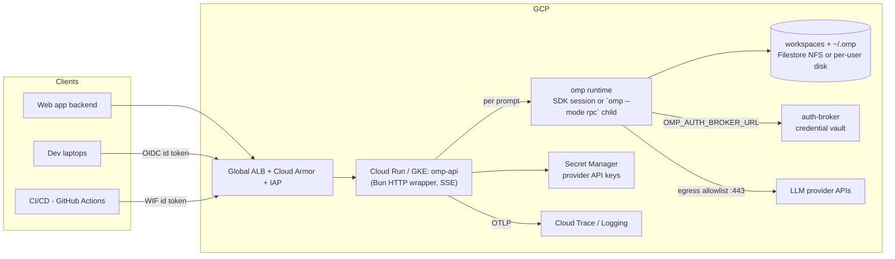

# Deploying oh-my-pi (omp) on GCP — Architecture & Deployment Report

*Prepared 2026-09-06 against `@oh-my-pi/pi-coding-agent` 18.1.11. All omp-specific claims are grounded in this repo with file cites; GCP product behavior is standard practice; all `$` figures are ballpark list prices (us-central1) — verify current pricing.*

---

## 1. Overview

**Feasible and sensible, with one non-negotiable constraint:** omp is a stateful, workspace-resident agent that executes arbitrary shell commands. Hosting it on GCP means wrapping one of its integration surfaces in an HTTP service, externalizing/persisting its state, and treating the compute boundary (container/VM) — not the API layer — as the security perimeter.

omp already ships everything needed for server-side hosting:

| Surface | Invocation | Transport | Grounding |
|---|---|---|---|
| One-shot headless | `omp -p "prompt"`, `--mode text\|json` | stdout (text or JSONL events) | `src/cli/args.ts:23,267`, `src/modes/print-mode.ts` |
| RPC server | `omp --mode rpc` | **stdio JSONL** (`prompt`, `steer`, `new_session`, `switch_session`, `get_state`, `set_model`, `negotiate_protocol`, …); `ready` frame at startup; 1 MiB frames (v2 reassembly to 64 MiB) | `src/modes/rpc/rpc-mode.ts:1082-1262`, `docs/rpc.md` |
| ACP | `omp --mode acp` | stdio (editor protocol) | `cli/args.ts:23` |
| TypeScript SDK | `createAgentSession()` — in-process `AgentSession` with `prompt()/subscribe()/steer()/abort()/dispose()/setModel()` | function calls + event stream | `src/sdk.ts:1305`, `docs/sdk.md` |
| Auth vault | `omp auth-broker serve/login/token` — remote credential store, clients point at it via `OMP_AUTH_BROKER_URL`/`OMP_AUTH_BROKER_TOKEN` | HTTPS | `src/cli/auth-broker-cli.ts`, `settings-schema.ts:479-485` |
| Observability | opt-in OpenTelemetry (`telemetry: {}` → GenAI-semconv spans `invoke_agent`/`chat`/`execute_tool`); `omp stats` dashboard over session JSONL | OTLP / SQLite | `packages/agent/src/telemetry.ts`, `packages/stats/README.md` |

What's **not** included: an HTTP server. You build a thin one (§6.3) — that's the entire integration work.

**State model (what a deployment must persist):** everything hangs off `~/.omp` (`packages/utils/src/dirs.ts:298-402`), overridable via `PI_CONFIG_DIR` / `PI_CODING_AGENT_DIR` / XDG / `OMP_PROFILE` (profiles → `~/.omp/profiles/<name>/agent`):

| State | Path | Notes |
|---|---|---|
| Sessions | `~/.omp/agent/sessions/<encoded-cwd>/<ts>_<sessionId>.jsonl` | JSONL; resume = replay file (`session-paths.ts:40-43`, `session-manager.ts:1156`) |
| Credential vault | `~/.omp/agent/agent.db` | SQLite (`sqlite-credential-store.ts:512`) |
| Model config | `~/.omp/agent/models.yml` | per-provider `baseUrl/apiKey/headers`, custom models (`model-registry.ts:378`) |
| Settings | `~/.omp/agent/config.yml` (+ project `.omp/config.yml`) | model roles, approval policy |
| Context | `~/.omp/agent/AGENTS.md`, project `.omp/AGENTS.md`, skills/extensions/prompts dirs | |
| Logs | `~/.omp/logs/omp.YYYY-MM-DD.<PID>.log` | rolling, 5 files (`logger.ts:246-247`); services can switch to console transport (`logger.ts:4-7`) |

Provider keys come from env (`OPENAI_API_KEY`, `ANTHROPIC_API_KEY|ANTHROPIC_OAUTH_TOKEN`, `GEMINI_API_KEY`, `MISTRAL_API_KEY`, `XAI_API_KEY`, `OPENROUTER_API_KEY`, `AZURE_OPENAI_API_KEY`, …; precedence: OAuth > env > stored key) — `packages/ai/src/registry/hooks/env.ts:29-34`. Model selection: `provider/model` ids (`config/model-resolver.ts`) and `modelPattern` allowlists on the SDK.

---

## 2. Recommended Architecture (at a glance)

**API tier** (stateless HTTP wrapper, SSE streaming) → **session tier** (one omp runtime per active session, SDK-embedded or `--mode rpc` subprocess) → **state tier** (per-tenant workspace + session dirs) → **GCP-managed auth/secrets/observability**.



---

## 3. GCP Architecture Options

### 3.1 Compute Engine VM (long-lived process, systemd)

- **How omp runs:** one `omp-api` wrapper service (systemd) hosting many sessions in-process via the SDK, or forking one `omp --mode rpc` child per session. Full Linux toolchain on local disk — best fidelity for git/build/test-heavy agent work (the agent can even use Docker on the VM).
- **Wrapping:** Bun/Node HTTP server; SSE for streaming. Per-tenant isolation via `PI_CONFIG_DIR`/`agentDir` (separate sessions + credential DB per tenant, §5) and optionally separate UNIX users per tenant.
- **Networking:** no public ingress on the VM. Global HTTP(S) LB → instance group (or a single instance behind IAP-protected LB); SSH only via IAP tunnel; firewall: allow `130.211.0.0/22, 35.191.0.0/16` from LB health checks only. TLS at the LB with Google-managed certs; Cloud DNS `A/AAAA` to the LB IP.
- **Scaling:** vertical only (resize + restart); availability = single zone, RTO ≈ re-provision from snapshot + Terraform (minutes). Rolling updates = second VM behind the LB or blue/green swap.
- **Cost:** ~$100/mo (e2-standard-4, sustained) + ~$10 disk; ~$30 spot. **Cheapest steady-state option; simplest ops.**

### 3.2 Cloud Run (containerized omp wrapper)

- **How omp runs:** same wrapper image; three persistence modes:
  1. **Turn-stateless (automation/CI-shaped):** each `/prompt` rehydrates workspace+session from GCS, runs the turn, persists, exits. Scale-to-zero works; per-turn clone/restore overhead.
  2. **Single warm instance** (`max-instances=1`, `min-instances=1`): in-memory session map + local disk (instance-ephemeral); WebSocket/SSE streaming; survives via instance restarts only if state rehydrated from GCS. "Serverless VM."
  3. **Shared volume** (`max-instances>1`): NFS (Filestore via Cloud Run volume mount) for `/workspaces` + `/state/.omp`; any instance can host any session with per-session locks. True horizontal scale.
- **Networking:** Cloud Run with `--no-allow-unauthenticated` (Google-signed OIDC enforced by the platform); optional global LB + Serverless NEG + IAP for human SSO; custom domain mapping + Cloud DNS.
- **Scaling:** per-instance CPU/RAM knobs; concurrency 4–16 (agent turns are CPU-bound, keep concurrency low); scale-to-zero only sane in mode 1. Request timeout cap 60 min — long agent turns fit, but design clients for reconnect.
- **Caveats (honest):** GCS-FUSE is too slow for git-heavy workspaces — use NFS or mode 2; container FS is ephemeral; the container can reach the metadata server (§4.3).

### 3.3 GKE (per-user pods)

- Meaningfully changes the design **only when you need hard per-tenant isolation at scale**: one Deployment per user (or namespace per team) running the same `omp-api` image, PVC per user (Filestore CSI / PD), Workload Identity per tenant SA, `NetworkPolicy` egress allowlist (provider APIs on 443, **deny 169.254.169.254** metadata), PodSecurity `restricted`, HPA/KEDA. Autopilot removes node ops. Cost: ~$73/mo zonal control plane (Standard) + per-pod; Autopilot pay-per-resource.

### 3.4 Comparison

| | VM | Cloud Run | GKE |
|---|---|---|---|
| Time to first deploy | ~1 h | ~1 h (image exists: root `Dockerfile`) | ~1 day |
| Ops burden | Low | Lowest | Highest (use Autopilot) |
| Cost @ 1–5 active users | ~$100/mo ✅ | ~$260–320/mo always-on; ~$0 scale-to-zero | ~$73 + pods |
| Cost @ high utilization | Best | Worst | Good |
| Workspace FS perf | Native disk ✅ | Ephemeral / NFS | Native (PD) ✅ |
| Isolation ceiling | OS users / containers | Container-per-instance | Pod/namespace ✅ |
| Scaling | Vertical | Horizontal (mode 3) / none (mode 2) | Horizontal ✅ |
| HA story | Re-provision (RTO minutes) | Platform-managed ✅ | Platform-managed ✅ |
| Fit | Internal team, shared server | API-first, bursty, web-app backend | Many tenants, compliance isolation |

**Recommendation:** start with **Cloud Run mode 2** (single warm instance) if your users are API-shaped and utilization is low; a single **VM** if 1–10 people code interactively all day (fs perf + cost); move to **GKE per-user pods** when tenants are mutually untrusted or you need horizontal scale. Do not run per-user Cloud Run *services* — service-per-tenant is operationally heavy; GKE does tenancy better.

---

## 4. Network & Security Design

### 4.1 Edge & authentication

| Caller | Mechanism |
|---|---|
| Humans (browser, dev laptops) | IAP on global LB → Google SSO + group-based authz; wrapper trusts `X-Goog-Authenticated-User` after IAP. Alternative: app-level JWT (e.g. your web app mints short-lived JWTs; wrapper verifies with JWKS). |
| Web app backend → omp | Service-to-service: Google-signed ID token (`Authorization: Bearer`), enforced by Cloud Run IAM or verified at the wrapper. |
| CI/CD | GitHub Actions → Workload Identity Federation → mint ID token → same bearer path. No SA keys. |
| Third parties needing opaque keys | Put API Gateway/Apigee in front (key → attached ID token). Avoid hand-rolled API keys otherwise. |

### 4.2 Secrets (LLM providers)

- Simple: Secret Manager → injected as env (`--set-secrets ANTHROPIC_API_KEY=…`) or as files. omp reads provider keys from env (`packages/ai/src/registry/hooks/env.ts`).
- Multi-provider/per-tenant: run **`omp auth-broker serve`** as the credential vault; runtimes authenticate with `OMP_AUTH_BROKER_URL`/`OMP_AUTH_BROKER_TOKEN` (grounded: `settings-schema.ts:479-485`). One vault, N runtimes, no provider keys in tenant-reachable env.
- Per-provider overrides/base URLs: `models.yml` (`baseUrl`, `apiKey`, `headers`; supports env substitution) — `model-registry.ts:378`.

### 4.3 Agent-specific threat model (the part that matters)

The agent executes model-chosen shell commands in the workspace; repos can carry prompt-injected instructions. Therefore:

1. **Perimeter = container/VM**, never the approval layer alone.
2. **Approval defaults are permissive:** `yolo` is the default approval mode (auto-approves `read`+`write`+`exec`; `docs/approval-mode.md:22`) and headless runs can't answer prompts (prompt-requiring calls fail closed, `docs/approval-mode.md:83,162`). Server postures:
   - *Sandboxed* (recommended for trusted users): keep `yolo` inside an isolated container/VM + egress allowlist + `tools.approval` deny/pattern policies (still enforced in yolo, `docs/approval-mode.md:64`).
   - *Semi-restricted*: `tools.approvalMode: write` + per-tool `tools.approval.<tool>: deny|prompt` (prompt → rejected headless). Tiers: `read`/`write`/`exec` (`src/tools/approval.ts:37-41`).
3. **Runtime SA minimization:** the runtime's Google identity must be least-privilege. On GKE, NetworkPolicy-deny the metadata IP; on Cloud Run you cannot — use a runtime SA distinct from the deploy SA with only the scopes the agent tier needs, and put storage/secret access in the wrapper, not in anything the agent's shell inherits.
4. **Workspace hygiene:** project `.env` files are loaded at boot (`utils/src/env.ts:240-243`) — assume workspace files can influence the agent process env. Mount workspaces per-tenant; never mount shared secrets into tenant-visible paths.
5. Egress: VPC egress allowlist to provider API hosts (Secure Web Proxy / Cloud NAT + firewall, or GKE NetworkPolicy).

### 4.4 DNS/TLS

Cloud DNS zone → LB (Google-managed cert) → IAP; or Cloud Run custom domain mappings. No public SSH (IAP tunnel only), no public DBs.

---

## 5. Multi-Tenancy: Shared vs Per-User

**Option A — shared runtime, logical sessions.** One omp-api process; tenant = API identity + per-tenant `agentDir` (`createAgentSession({ agentDir })` / `PI_CONFIG_DIR`), giving separate sessions, `agent.db` credential vault, and `models.yml` per tenant. Sessions are additionally partitioned by workspace cwd (session dir is encoded per-cwd, `session-paths.ts:40-43`). Concurrent top-level sessions need a private `AgentRegistry` per session (`docs/sdk.md:97-99`).

**Option B — per-user isolated spaces.** One container/pod/VM-account per user: own workspace root, own `~/.omp`, own process. Routing by URL prefix (`/u/<user>/…`) or subdomain.

| | A: shared instance | B: per-user isolation |
|---|---|---|
| Security/data isolation | Weak-medium: process-level escape or prompt injection can reach sibling tenants' files; secrets must live outside tenant reach (auth-broker or wrapper-held) | Strong: kernel/container boundary; blast radius = one tenant |
| Resource cost | Cheapest; one process, shared caches | N × footprint; more machines/pods |
| Ops complexity | Session map + per-session locks + per-tenant dirs; one deploy | Fleet orchestration, per-user volumes, routing, drift |
| Session/context mgmt | Single service; logical scoping by sessionId→tenant table | Natural (each unit owns its sessions) |
| History storage | Shared disk, per-tenant subtrees | Per-tenant disk/PVC |
| Model/key management | Central vault (auth-broker) shines | Per-tenant keys or vault |
| When | ≤ ~10 mutually-trusting users, internal team, cost-sensitive | External/multi-company users, untrusted repo content, compliance, >20 users |

**Recommendation:** shared **only** for a trusted internal team, with per-tenant `agentDir`/profiles and a central auth-broker (never one OS account + one shared `~/.omp` for all tenants). The moment tenants are mutually untrusted or the service is internet-facing for third parties: per-user containers (GKE), per-user VMs, or per-user UNIX accounts on a single box.

---

## 6. Deployment Steps — recommended pattern (Cloud Run, SDK-embedded)

### 6.1 Container image

The repo root `Dockerfile` already builds a runnable image (verified): stages `natives-builder` (Rust→`pi_natives.*.node`) → `wheel-builder` (`omp_rpc` Python wheel) → `pi-base` (python+bun+tini+git+ssh, `omp` shim honoring `PI_ROOT`) → `pi-runtime` (source baked, default target). For a server, extend `pi-base`/`pi-runtime`:

```dockerfile
ARG PI_BASE=oh-my-pi/pi:dev          # built from repo root Dockerfile
FROM ${PI_BASE} AS pi-base

COPY server.ts /app/server.ts        # your thin HTTP wrapper (§6.3)
ENV PI_ROOT=/pi PI_CONFIG_DIR=/state/.omp OMP_HOME=/workspaces
RUN mkdir -p /state/.omp /workspaces
# add your team's default toolchain the agent should have (gh, jq, ripgrep, …)
RUN apt-get update && apt-get install -y --no-install-recommends ripgrep jq && rm -rf /var/lib/apt/lists/*
WORKDIR /app
ENTRYPOINT ["/usr/bin/tini", "--", "bun", "/app/server.ts"]
```

Build/push: `gcloud builds submit --tag us-central1-docker.pkg.dev/PROJECT/omp/omp-api .`

### 6.2 GCP infrastructure

```bash
gcloud services enable run.googleapis.com secretmanager.googleapis.com \
  artifactregistry.googleapis.com storage.googleapis.com

gcloud iam service-accounts create omp-api-runtime   # minimal: no project roles needed
gcloud secrets create anthropic-key --data-file=- <<< "$ANTHROPIC_API_KEY"
gcloud secrets add-iam-policy-binding anthropic-key \
  --member=serviceAccount:omp-api-runtime@PROJECT.iam.gserviceaccount.com --role=roles/secretmanager.secretAccessor
gcloud storage buckets create gsPROJECT-omp-state --location=us-central1 --uniform-bucket-level-access
gcloud storage buckets add-iam-policy-binding gsPROJECT-omp-state \
  --member=serviceAccount:omp-api-runtime@PROJECT.iam.gserviceaccount.com --role=roles/storage.objectAdmin

gcloud run deploy omp-api \
  --image us-central1-docker.pkg.dev/PROJECT/omp/omp-api \
  --service-account omp-api-runtime@PROJECT.iam.gserviceaccount.com \
  --region us-central1 --cpu 4 --memory 8Gi --concurrency 8 \
  --min-instances 1 --max-instances 1 \
  --no-allow-unauthenticated \
  --set-env-vars PI_CONFIG_DIR=/state/.omp,WORKSPACES=/workspaces,STATE_BUCKET=PROJECT-omp-state \
  --set-secrets ANTHROPIC_API_KEY=anthropic-key:latest
```

Callers (CI) then need `roles/run.invoker` on the service. Humans: add global LB + Serverless NEG + IAP (or Cloud Run domain mapping + app-level JWT) per §4.1. Mount the state bucket via GCS FUSE volume, or add Filestore (NFS) if workspaces are git-heavy and you want `max-instances > 1`.

### 6.3 The wrapper service (condensed but real)

```ts
import { createAgentSession, SessionManager, AgentRegistry, type AgentSession } from "@oh-my-pi/pi-coding-agent";

type Tenant = { id: string };
type Sess = { session: AgentSession; registry: AgentRegistry; busy: boolean };

const sessions = new Map<string, Sess>();

async function open(tenant: Tenant, sessionId: string, opts: { cwd: string; resume?: string }) {
  const registry = new AgentRegistry();                 // concurrent sessions need private registries (docs/sdk.md:97)
  const sessionManager = opts.resume
    ? await SessionManager.open(opts.resume)
    : SessionManager.create(opts.cwd);
  const { session } = await createAgentSession({
    cwd: opts.cwd,
    agentDir: `/state/.omp/tenants/${tenant.id}/agent`, // per-tenant sessions+vault+models.yml
    sessionManager, registry,
    autoApprove: true,                                   // yolo inside the sandbox; or settings.override("tools.approvalMode", "write")
    modelPattern: "anthropic/*,openai/*",                // tenant allowlist
    telemetry: {},                                       // GenAI spans -> OTLP -> Cloud Trace
  });
  const s = { session, registry, busy: false };
  sessions.set(sessionId, s);
  return s;
}

Bun.serve({
  port: Number(process.env.PORT ?? 8080),
  async fetch(req) {
    const url = new URL(req.url);
    if (url.pathname === "/healthz") return new Response("ok");

    // POST /v1/sessions/:id/prompt  -> SSE
    const m = url.pathname.match(/^\/v1\/sessions\/([^/]+)\/prompt$/);
    if (req.method === "POST" && m) {
      const s = sessions.get(m[1]);
      if (!s) return json({ error: { code: "not_found" } }, 404);
      if (s.busy) return json({ error: { code: "session_busy" } }, 409);
      s.busy = true;
      const { text } = (await req.json()) as { text: string };
      const stream = new ReadableStream({
        start(ctrl) {
          const unsub = s.session.subscribe(ev => {
            ctrl.enqueue(enc(`data: ${JSON.stringify(ev)}\n\n`)); // forward AgentSessionEvent (message_update/text_delta, tool events, …)
          });
          s.session.prompt(text)
            .catch(e => ctrl.enqueue(enc(`event: error\ndata: ${JSON.stringify({ message: String(e) })}\n\n`)))
            .finally(() => { unsub(); s.busy = false; ctrl.close(); });
        },
      });
      return new Response(stream, { headers: { "content-type": "text/event-stream" } });
    }
    // ... POST /v1/sessions (create), GET /v1/sessions/:id (get_state), POST .../steer|abort, DELETE ...
    return json({ error: { code: "not_found" } }, 404);
  },
});
```

Process-isolation variant: replace the embedded session with a spawn of `omp --mode rpc` per session and bridge stdin/stdout JSONL to SSE/WebSocket (protocol in `docs/rpc.md`; Python clients can use the shipped `omp_rpc` wheel). Same API shape, stronger isolation, slightly more overhead.

### 6.4 VM variant (condensed)

1. `gcloud compute instances create omp-server --machine-type=e2-standard-4 --shielded-secure-boot` (Debian), no external IP; IAP-SSH only.
2. Install Bun; deploy the same `server.ts` + image contents (or `docker run oh-my-pi/pi:dev` base); state on a 200 GB pd-balanced disk at `/state`.
3. systemd unit:

```ini
[Service]
ExecStart=/opt/bun/bin/bun /srv/omp-api/server.ts
Environment=PI_CONFIG_DIR=/state/.omp PORT=8080
EnvironmentFile=/srv/omp-api/env.secrets     # provider keys, or use auth-broker instead
Restart=always
User=omp
```

4. Caddy/nginx on :8080 behind the LB; Cloud Scheduler + script: `sqlite3 agent.db ".backup ..."` + `gsutil -m rsync` of `/state/.omp` and workspaces → GCS (nightly), daily disk snapshots.

### 6.5 GKE variant (condensed)

Per-tenant: `Deployment` (1 replica) of the same image + `PVC` (Filestore CSI) for `/state` + `/workspaces`; `NetworkPolicy`: deny egress `169.254.169.254/32`, allow 443 to provider FQDNs; PodSecurity `restricted`; Workload Identity SA per tenant; Service per tenant + a tiny gateway (or single gateway routing `/u/<user>`); HPA on CPU. Autopilot recommended.

---

## 7. Example API and Client Integration

**Contract**

| Method/Path | Body | Response |
|---|---|---|
| `POST /v1/sessions` | `{ workspace: "gitUrl"\|"existing:name", modelPattern?, model?, systemPrompt? }` | `201 { sessionId, sessionFile }` |
| `POST /v1/sessions/:id/prompt` | `{ text, stream?: true }` | SSE: `data: <AgentSessionEvent>` … final `event: done` `{ stopReason, usage }` |
| `POST /v1/sessions/:id/steer` | `{ text }` | `202` |
| `POST /v1/sessions/:id/abort` | — | `202` |
| `GET /v1/sessions/:id` | — | `{ state }` (RPC `get_state` equivalent) |
| `DELETE /v1/sessions/:id` | — | `204` |
| `GET /healthz` | — | `200` |

Errors: `{ "error": { "code": "unauthorized|forbidden|not_found|session_busy|rate_limited|internal", "message", "requestId" } }`; `409` when a turn is already running; `429` from a token-bucket per tenant.

**Local machine (curl):**

```bash
TOKEN=$(gcloud auth print-identity-token)          # or via IAP session cookie
BASE=https://omp-api-xxxxxxxx-uc.a.run.app

SID=$(curl -sS -H "Authorization: Bearer $TOKEN" -H 'content-type: application/json' \
  -d '{"workspace":"https://github.com/acme/api.git","modelPattern":"anthropic/*"}' \
  $BASE/v1/sessions | jq -r .sessionId)

curl -N -H "Authorization: Bearer $TOKEN" -H 'content-type: application/json' \
  -d '{"text":"Fix the failing test in src/auth.ts and run the suite"}' \
  $BASE/v1/sessions/$SID/prompt                    # -N = stream SSE live
```

**Web app (TypeScript):**

```ts
const res = await fetch(`${BASE}/v1/sessions/${sid}/prompt`, {
  method: "POST",
  headers: { authorization: `Bearer ${idToken}`, "content-type": "application/json" },
  body: JSON.stringify({ text: prompt }),
});
const reader = res.body!.getReader();
const dec = new TextDecoder(); let buf = "";
while (true) {
  const { done, value } = await reader.read();
  if (done) break;
  buf += dec.decode(value, { stream: true });
  for (const frame of buf.split("\n\n").slice(0, -1)) {
    if (frame.startsWith("data: ")) onEvent(JSON.parse(frame.slice(6)));  // text_delta -> UI
  }
  buf = buf.slice(buf.lastIndexOf("\n\n") + 2);
}
```

**CI (GitHub Actions, keyless):**

```yaml
permissions: { id-token: write }
- run: |
    TOKEN=$(gcloud auth print-identity-token --impersonate-service-account=ci-caller@PROJECT.iam.gserviceaccount.com)
    curl -sS -H "Authorization: Bearer $TOKEN" -d '{"text":"Review PR $PR_NUMBER diff for security issues"}' \
      $BASE/v1/sessions/$REVIEW_SESSION/prompt
```

(For review bots, also consider just running `omp -p "…"` inside the CI job itself — no server needed.)

---

## 8. Operations, Monitoring, and Cost

**Logging.** Wrapper logs structured JSON to stdout → Cloud Logging (request id, tenant, session, latency). omp's own logger writes per-process files under `~/.omp/logs` with rolling retention (`logger.ts:246-247`); switch it to console for services (`setTransports({console:true,file:false})`, `logger.ts:4-7`) so agent-internal logs land in Cloud Logging too. Create log-based metrics for provider 429/5xx.

**Tracing.** Enable `createAgentSession({ telemetry: {} })` + OTLP exporter → Cloud Trace: spans `invoke_agent`/`chat {model}`/`execute_tool {tool.name}` with GenAI usage/cost attributes (grounded: `packages/agent/src/telemetry.ts`). Correlate with the wrapper's request-id.

**Metrics/alerts.** Uptime check on `/healthz`; alert on 5xx rate, p95 prompt latency, busy-409 rate; budget alerts on the billing account. Optional: run the `omp stats` sync against the persisted sessions dir (`packages/stats` reads `~/.omp/agent/sessions/**.jsonl` → `stats.db`) and expose its dashboard behind IAP.

**Backup / DR.**

| State | Method | RPO / RTO |
|---|---|---|
| Sessions + agent.db + config | GCS sync after each turn (Cloud Run) or nightly (VM); `sqlite3 .backup` for the DB | ≤1 turn / 24 h; RTO: re-provision + restore ≈ 15 min |
| Workspaces | Git remote is primary; sync uncommitted diffs to GCS | ≤1 turn |
| Infra | Terraform state in GCS | RTO ≈ one `apply` |

**Cost ballpark (list, us-central1):** VM e2-standard-4 ~$100/mo (+spot ~$30); Cloud Run 4 vCPU/8 GiB warm ≈ $260–320/mo, ~$0 idle in turn-stateless mode; GKE Standard zonal ~$73 + nodes (Autopilot: per-pod); Filestore (if used) ~$150–200/mo; GCS ~$0.02/GB-mo; LB+IAP ~$20–30/mo.

---

## 9. Extensions

- **Multiple providers behind omp:** already native — bundled catalog + `models.yml` overrides + `modelPattern` allowlists per tenant; `set_model` over RPC / `setModel()` on the SDK for per-request switching; per-tenant keys via `auth-broker`. Wire-level model quirks live in the catalog's KDL rule tree — nothing to reimplement server-side.
- **CI/CD:** pattern in §7; WIF for GitHub/GitLab; long-running automation should prefer one-shot sessions (`POST /v1/sessions` → prompt → `DELETE`) with `--mode json`-style event capture for artifacts.
- **IaC:** Terraform (not Deployment Manager): `google_project_service`, `google_artifact_registry_repository`, `google_storage_bucket`, `google_service_account` + IAM bindings, `google_secret_manager_secret`, `google_cloud_run_v2_service` (or `google_compute_instance`/MIG), `google_compute_region_network_endpoint_group` (serverless NEG) + `google_iap_web_backend_service`, `google_dns_record_set`, `google_compute_snapshot_schedule`. One module per environment; state in GCS.

---

## Appendix — grounded fact index

- SDK entry/quick-start: `docs/sdk.md:37-60`; `createAgentSession` at `src/sdk.ts:1305`; options `cwd/agentDir/modelPattern/autoApprove/sessionManager/telemetry` at `sdk.ts:377-660`; private `AgentRegistry` per concurrent session: `docs/sdk.md:97-99`.
- RPC protocol + command set: `src/modes/rpc/rpc-mode.ts:1082-1262`, `docs/rpc.md`; frame caps `rpc-frame.ts:6,8`.
- Headless: `-p` at `src/cli/args.ts:267`; `--mode text|json|rpc|acp` at `args.ts:23`, `flag-tables.ts:124`.
- Approval tiers/modes and headless fail-closed: `src/tools/approval.ts:37-41`, `docs/approval-mode.md:14-24,64,83,162`.
- State layout: `packages/utils/src/dirs.ts` (root/agent dir/sessions/logs, env overrides, `OMP_PROFILE`); session naming `session-manager.ts:1156`, per-cwd dirs `session-paths.ts:40-43`; creds DB `sqlite-credential-store.ts:512`; models.yml `model-registry.ts:378`; env keys `packages/ai/src/registry/hooks/env.ts:29-34`; boot `.env` loading `utils/src/env.ts:240-243`.
- Container: repo-root `Dockerfile` (pi-base/pi-runtime, `omp` shim, tini) — verified by read; `python/omp-rpc` wheel; compose example `python/robomp/docker-compose.yml`.
- Telemetry: `packages/agent/src/telemetry.ts` (GenAI semconv), `@opentelemetry/api` runtime dep.
- Auth vault: `src/cli/auth-broker-cli.ts` (`serve/login/token/import/migrate`), `settings-schema.ts:479-485` (`OMP_AUTH_BROKER_URL/TOKEN`).
